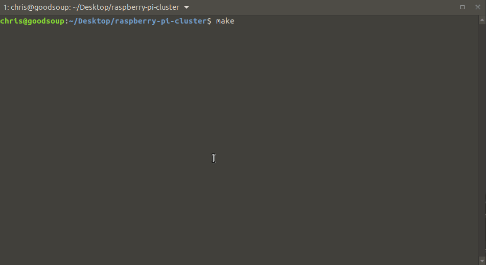

<p>
  <br>
  <h1 align="center">
    <a href="https://github.com/christopherwoodall/raspberry-pi-cluster">
      RPi Cluster
    </a>
  </h1>
  <h3 align="center">
    Under Construction
  </h3>
</p>

<h4 align="center">Tools for Deploying a Raspberry Pi Cluster.</h4>

<p align="center">
  <a href="#about">About</a> •
  <a href="#installation">Installation</a> •
  <a href="#features">Features</a> •
  <a href="#demo">Demo</a>
</p>

---

## About

This project contains a series of Ansible Playbooks, as well as BASH, Python, and other relevant tools to kick off the deployment of a Raspberry Pi cluster.


## Controller Installation
### Step 1
Install Ubuntu on your Raspberry Pi, setting the username and password to `ubuntu`.

### Step 2
Connect you're Pi to a local Wifi network. We will be using this as a management interface.

### Step 3
Once online, head over the the [`inventory.yml`](https://github.com/christopherwoodall/raspberry-pi-cluster/blob/main/ansible/inventory/inventory.yml) file and put in the correct IP address for your Pi. This will be given out by your local network DHCP provider.

### Step 4
In the root of the repository run the following command:
```
$ make run
```


## Features


## Demo
### Deployment


### Tools

